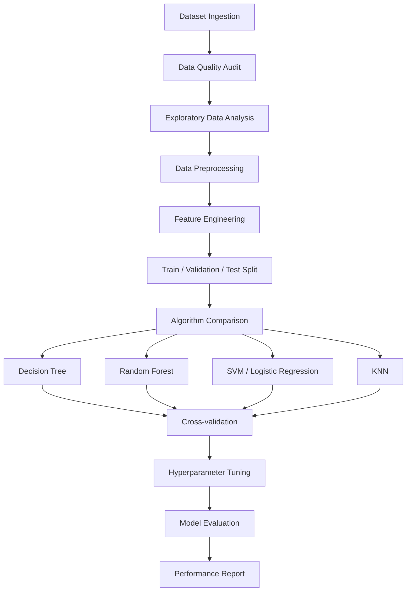

ML Pipeline with Python
> Comprehensive machine learning pipeline covering supervised learning workflows from data ingestion to model evaluation, with feature engineering, algorithm comparison, and cross-validation.
---
Overview
This repository demonstrates practical, production-oriented ML workflow implementation in Python. It covers the complete lifecycle from raw data to evaluated model — applying multiple algorithms, comparing performance systematically, and documenting design decisions at each stage. Intended as both a learning resource and a reproducible baseline for supervised ML projects.
---
System Architecture

---
Tech Stack
Layer	Technology
Data Wrangling	Pandas, NumPy
ML Models	Scikit-learn
Visualization	Matplotlib, Seaborn
Model Selection	GridSearchCV, RandomizedSearchCV, StratifiedKFold
Metrics	Accuracy, F1, Precision, Recall, AUC-ROC, Confusion Matrix
Language	Python 3.10+
---
Topics Covered
Data Preprocessing
Handling missing values (imputation strategies)
Outlier detection and treatment
Data type conversion and normalization
Train/validation/test splitting with stratification
Feature Engineering
Label encoding vs. one-hot encoding decision guide
Ordinal encoding for ordered categoricals
Feature scaling (StandardScaler, MinMaxScaler)
Variance threshold feature selection
Correlation-based feature removal
Model Training & Comparison
Decision Tree (with pruning via max_depth, min_samples_split)
Random Forest (ensemble bagging)
Support Vector Machine (kernel comparison: linear, RBF)
Logistic Regression (L1, L2 regularization)
K-Nearest Neighbors (distance metric analysis)
Evaluation Framework
Stratified K-Fold cross-validation
Precision-Recall curve analysis (for imbalanced targets)
ROC-AUC comparison across models
Confusion matrix visualization
Feature importance ranking
---
Project Structure
```
ML-1_With_Python/
├── notebooks/
│   ├── 01_data_exploration.ipynb
│   ├── 02_preprocessing.ipynb
│   ├── 03_feature_engineering.ipynb
│   ├── 04_model_training.ipynb
│   └── 05_evaluation.ipynb
├── src/
│   ├── preprocessing.py    # Reusable preprocessing functions
│   ├── features.py         # Feature engineering pipeline
│   ├── models.py           # Model wrapper classes
│   └── evaluate.py         # Evaluation utilities
├── data/                   # Sample datasets
└── requirements.txt
```
---
Setup
```bash
git clone https://github.com/anwarraif/ML-1_With_Python
cd ML-1_With_Python
pip install -r requirements.txt
jupyter notebook notebooks/01_data_exploration.ipynb
```
---
Learning Path
Notebook	Focus
01	Data exploration, distributions, correlations
02	Cleaning, imputation, encoding
03	Feature creation, selection, scaling
04	Training 5 algorithms with cross-validation
05	Metrics, ROC curves, confusion matrices, final selection
---
Author
Kurnia Anwar Ra'if — Data Scientist & AI Engineer  
LinkedIn | GitHub | kurniaanwarraif@gmail.com
